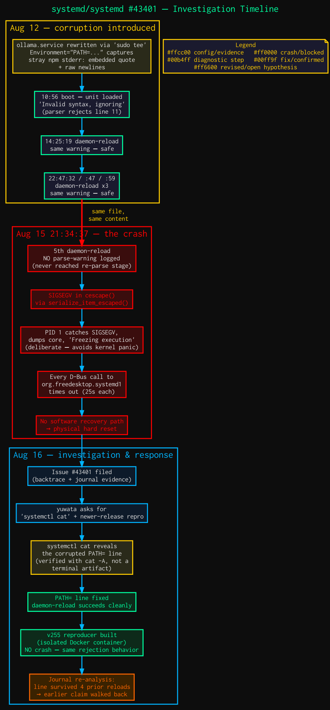
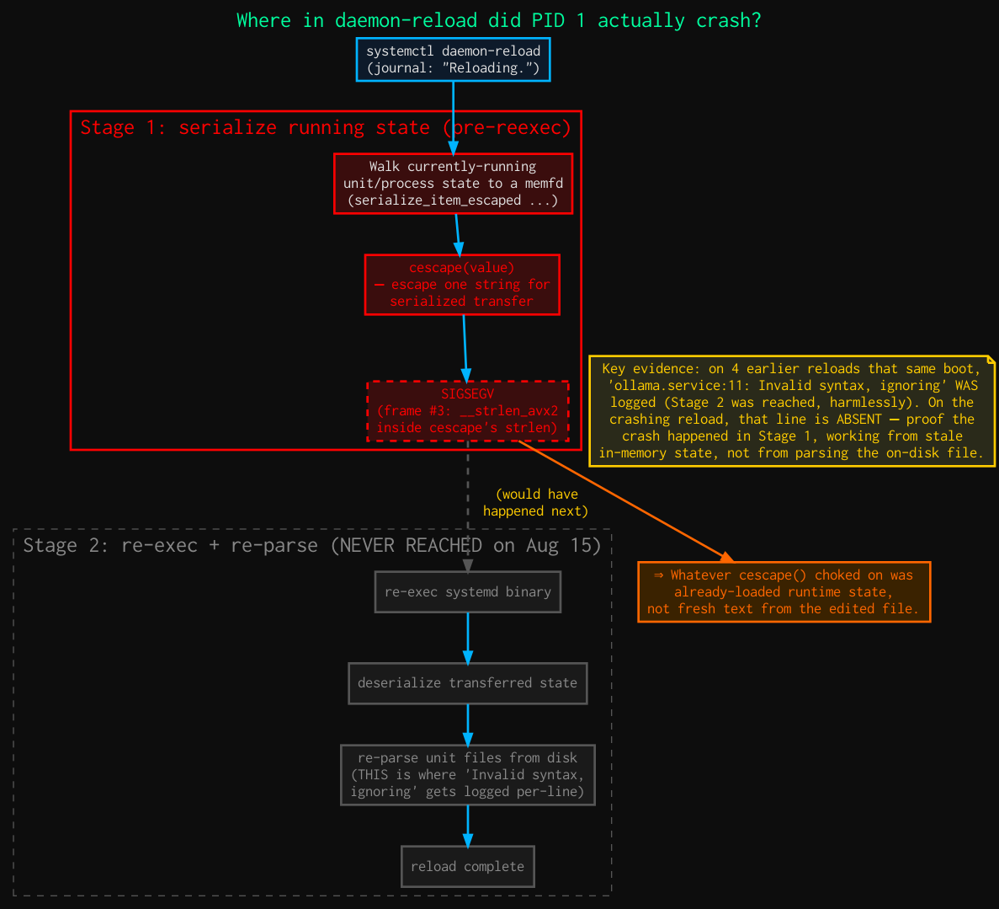
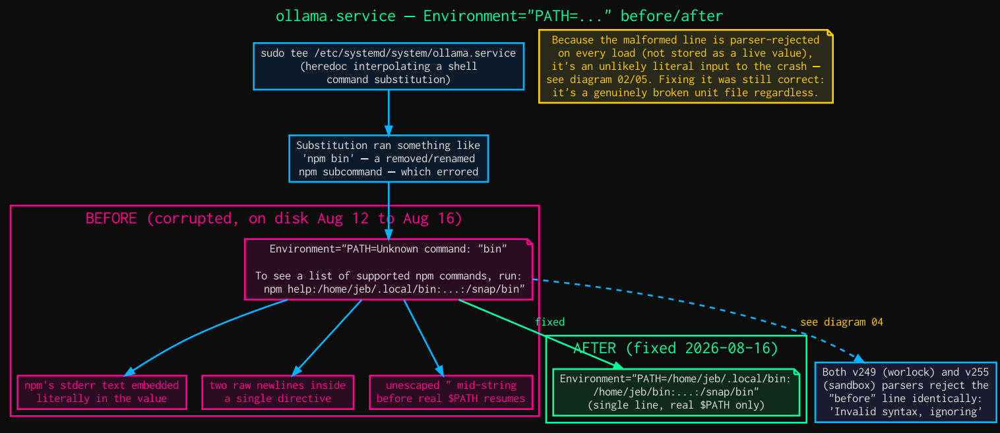
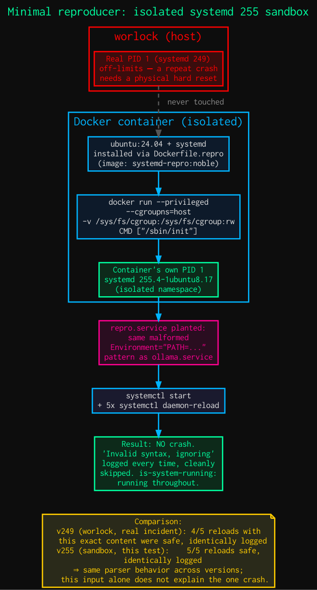
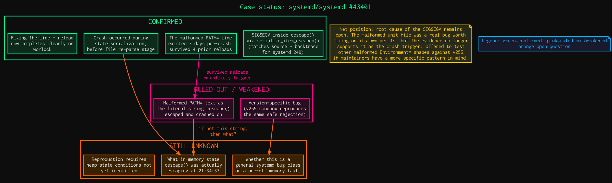

# systemd #43401 — PID 1 SIGSEGV Investigation Diagrams

<p align="center">
  <a href="https://github.com/systemd/systemd/issues/43401"></a>
  <a href="https://github.com/systemd/systemd/issues/43401#issuecomment-5308720889"></a>
  
  
  
  
  <a href="LICENSE"></a>
</p>

Five Graphviz diagrams (plus full write-up) explaining the investigation
behind **[systemd/systemd#43401](https://github.com/systemd/systemd/issues/43401)**:
a PID 1 SIGSEGV in `cescape()` / `serialize_item_escaped()` during
`systemctl daemon-reload`, which froze the machine and required a physical
hard reset to recover — followed by a fix attempt, a minimal reproducer
built against a newer systemd release, and an honest correction after the
reproducer's results didn't hold up the original hypothesis.

This repo exists purely to host rendered images for the upstream issue
thread (`systemd/systemd` isn't writable by this account, so inline image
attachments need somewhere to live) and to give the investigation a
permanent, browsable home independent of the GitHub issue's comment order.

## TL;DR

| | |
|---|---|
| **Symptom** | PID 1 (`systemd 249.11-0ubuntu3.22`, Ubuntu 22.04.5 LTS) caught SIGSEGV during `daemon-reload`, dumped core, and deliberately froze execution instead of exiting (systemd's documented crash-handler behavior, to avoid a kernel panic) |
| **Blast radius** | Every subsequent D-Bus call to `org.freedesktop.systemd1` timed out (25s each) — including `systemctl reboot` — because PID 1 never answered again |
| **Recovery** | No software path once PID 1 froze; required a physical hard reset |
| **Crash site** | `cescape()` called from `serialize_item_escaped()` (`src/shared/serialize.c`), confirmed against the matching v249 source tree and the coredump backtrace |
| **Initial hypothesis** | A malformed `Environment="PATH=..."` value in `ollama.service` (containing embedded `npm` CLI error text, raw newlines, and an unescaped quote) was the string `cescape()` choked on |
| **What the reproducer found** | That exact malformed value is **parser-rejected identically** on systemd 249 *and* 255, and had already survived **4 prior `daemon-reload`s over 3 days** before the crash — weakening the case that it was the trigger |
| **Current status** | The malformed unit file was fixed regardless (it was genuinely broken), but **the actual root cause of the SIGSEGV remains unidentified** |

## Timeline

| When | Event |
|---|---|
| Aug 12 | `ollama.service` rewritten via `sudo tee`; a shell command substitution apparently ran something like `npm bin` (a removed/renamed npm subcommand), and its stderr got captured literally into what should have been a clean `Environment="PATH=..."` value |
| Aug 12, 10:56–22:48 | Unit loaded/reloaded **4 times** with this malformed line in place — each time logged `Invalid syntax, ignoring` and safely skipped |
| **Aug 15, 21:34:37** | 5th `daemon-reload` — **no parse-warning logged this time** — PID 1 catches SIGSEGV in `cescape()`, dumps core, freezes execution |
| Aug 15, ~21:35+ | D-Bus calls time out repeatedly; `systemctl reboot` has no effect; physical hard reset required |
| Aug 16 | Issue [#43401](https://github.com/systemd/systemd/issues/43401) filed with full backtrace + journal evidence |
| Aug 16 | Maintainer [asks](https://github.com/systemd/systemd/issues/43401#issuecomment-5305731339) for `systemctl cat` output and a repro on a current release |
| Aug 16 | `systemctl cat` reveals the corrupted `PATH=` line — verified with `cat -A` against the raw file to rule out a terminal rendering artifact |
| Aug 16 | Line fixed, `systemd-analyze verify` passed, `daemon-reload` completed cleanly — [reported](https://github.com/systemd/systemd/issues/43401#issuecomment-5308658793) as a likely fix |
| Aug 16 | Minimal reproducer built: isolated systemd 255 sandbox (Docker, own PID 1, host untouched) — **no crash**, identical `Invalid syntax, ignoring` rejection |
| Aug 16 | Re-checking worlock's own journal shows the malformed line predates the crash by 3 days and survived 4 earlier reloads — [correction posted](https://github.com/systemd/systemd/issues/43401#issuecomment-5308683701), walking back the fix-as-root-cause claim |
| Aug 16 | These 5 diagrams built and [posted](https://github.com/systemd/systemd/issues/43401#issuecomment-5308720889) to summarize the above visually |

## The diagrams

All diagrams use a consistent color key:
🟢 `#00ff9f` confirmed/fix &nbsp;·&nbsp; 🔵 `#00b4ff` diagnostic step &nbsp;·&nbsp;
🟡 `#ffcc00` config/evidence &nbsp;·&nbsp; 🟠 `#ff6600` open question &nbsp;·&nbsp;
🩷 `#ff0090` ruled out &nbsp;·&nbsp; 🔴 `#ff0000` crash/blocked

### 1. Investigation timeline
End-to-end chronology as a sequence of clusters — corruption introduced,
four safe reloads, the crash, and the Aug 16 response — so the "4 safe
reloads before the crash" evidence is visible at a glance rather than
buried in journal timestamps.



### 2. `daemon-reload` internals: where the crash actually happened
`daemon-reload` serializes currently-running unit/process state to a
memfd *before* re-execing and re-parsing unit files from disk. This
diagram traces that pipeline and marks exactly where the SIGSEGV occurred
(Stage 1, the serialize step) versus where it did *not* get far enough to
reach (Stage 2, the re-parse step where the familiar "Invalid syntax,
ignoring" warning would normally be logged). The absence of that log line
on the crashing reload is the key evidence this diagram is built around.



### 3. The corrupted `PATH=` line, before/after
Shows exactly what the malformed `Environment=` directive contained
(embedded `npm` error text, two raw newlines, an unescaped `"` mid-value),
a hypothesis for how it got there, and the clean single-line replacement.



### 4. Reproducer methodology
The isolated test environment used to check this against a current
systemd release without risking the host: a Docker container running
Ubuntu 24.04 (`systemd 255.4-1ubuntu8.17`) as its own PID 1
(`--privileged --cgroupns=host`, `/sys/fs/cgroup` bind-mounted,
`/sbin/init` as entrypoint), with the same malformed unit planted inside
and 5 `daemon-reload`s run against it.



```dockerfile
FROM ubuntu:24.04
RUN apt-get update && \
    apt-get install -y systemd systemd-sysv gdb && \
    apt-get clean && rm -rf /var/lib/apt/lists/*
STOPSIGNAL SIGRTMIN+3
CMD ["/sbin/init"]
```

```bash
docker run -d --name sysd-repro \
  --privileged --cgroupns=host \
  --tmpfs /tmp --tmpfs /run --tmpfs /run/lock \
  -v /sys/fs/cgroup:/sys/fs/cgroup:rw \
  systemd-repro:noble
```

### 5. Case status / evidence map
A confirmed / ruled-out / still-unknown breakdown, closing out where the
investigation currently stands.



## Repository structure

```
.
├── README.md
├── LICENSE
└── diagrams/
    ├── 01_investigation_timeline.{dot,png,svg}
    ├── 02_reload_internals_crash_point.{dot,png,svg}
    ├── 03_path_corruption_before_after.{dot,png,svg}
    ├── 04_reproducer_methodology.{dot,png,svg}
    └── 05_evidence_map_conclusion.{dot,png,svg}
```

## Regenerating the diagrams

Each `.dot` source renders independently with standard Graphviz:

```bash
cd diagrams
for f in *.dot; do
  dot -Tpng "$f" -o "${f%.dot}.png"
  dot -Tsvg "$f" -o "${f%.dot}.svg"
done
```

Rendered with Graphviz 2.43.0 (`dot -V`). No other dependencies.

## Links

- Upstream issue: [systemd/systemd#43401](https://github.com/systemd/systemd/issues/43401)
- Comment 1 — original report + `systemctl cat` output: [#issuecomment-5305731339](https://github.com/systemd/systemd/issues/43401#issuecomment-5305731339) *(maintainer request this replies to)*
- Comment 2 — fix applied, `daemon-reload` confirmed stable: [#issuecomment-5308658793](https://github.com/systemd/systemd/issues/43401#issuecomment-5308658793)
- Comment 3 — reproducer results + corrected analysis: [#issuecomment-5308683701](https://github.com/systemd/systemd/issues/43401#issuecomment-5308683701)
- Comment 4 — these diagrams: [#issuecomment-5308720889](https://github.com/systemd/systemd/issues/43401#issuecomment-5308720889)

## License

[MIT](LICENSE) — diagrams and write-up only; no systemd source code is
included in this repository.
